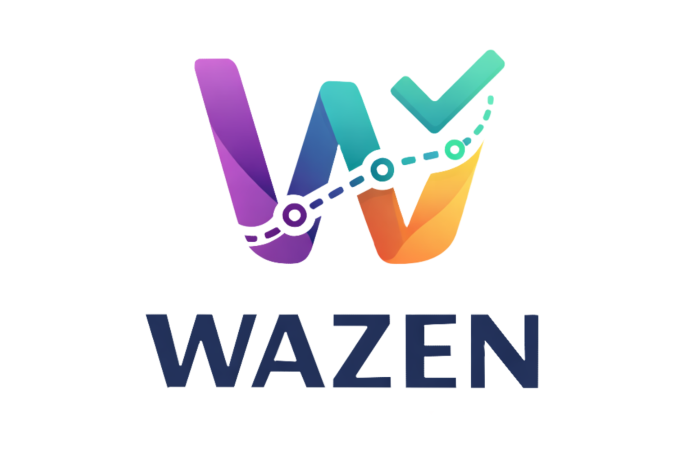

<p align="center">
  
</p>

<h1 align="center">Wazen</h1>

<p align="center">An AI-powered study planner that helps university students balance their workload and stay on track.</p>

---

## Features

- **Courses & deadlines**: add courses and track upcoming assignments and exams.
- **Availability**: set the hours you are free to study each week.
- **Study plan**: generate a weekly study plan from your courses, deadlines, and availability.
- **Progress & statistics**: log completed and missed sessions, and follow your completion rate and study hours on charts.
- **AI study advice**: personalized study tips generated by Google Gemini from your own progress data.
- **Notifications**: an in-app list of notifications for each student.
- **Secure accounts**: registration and login with hashed passwords (bcrypt) and JWT-protected routes.

## Tech stack

| Layer | Technologies |
| --- | --- |
| Frontend | React 19, Vite, React Router, Recharts |
| Backend | Node.js, Express 5 |
| Database | MongoDB Atlas |
| AI | Google Gemini API (`gemini-2.5-flash`) |
| Auth | bcrypt, JSON Web Tokens |

## Screenshots

<!-- Add 2–3 screenshots here: home page, dashboard, AI advice -->

## Getting started

### 1. Backend

```bash
cd backend
npm install
cp .env.example .env   # then fill in your own values
node server.js
```

Expected output:

```
Connected to MongoDB Atlas
Using database: Wazen_Group5
Server running on http://localhost:3000
```

### 2. Frontend

In a second terminal:

```bash
cd frontend
npm install
npm run dev
```

Open the local URL shown in the terminal (usually `http://localhost:5173`).

### Environment variables

Create `backend/.env` from `backend/.env.example`:

| Variable | Description |
| --- | --- |
| `MONGODB_URI` | MongoDB Atlas connection string |
| `GROUP_DB_NAME` | Database name |
| `PORT` | Backend port (default `3000`) |
| `JWT_SECRET` | Secret used to sign login tokens |
| `GEMINI_API_KEY` | Google AI Studio API key |

> MongoDB Atlas must allow your current IP address. The Gemini API has a usage limit; generate a new key if it is reached.

## Team

Built as a university team project (Group 5).
- Madleen Alqahtani
- Reema Alshaya
- Sara Bawazeer
- Renad Alduilej
- Shayma bin Abdan

